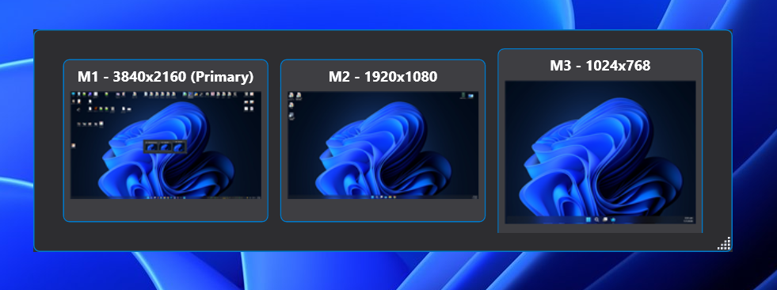
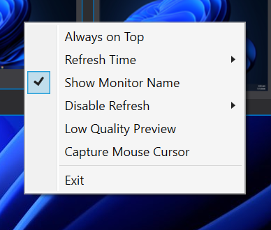

# LiveMonitorPreview

LiveMonitorPreview is a small desktop utility that shows a live preview of your desktop screen in a floating window.

## Screenshots

## Why

It helps you monitor an external screen that you cannot physically see, such as:

- Stage LED wall
- Projector screen
- External monitor in another location
- Presentation screen facing the audience

Instead of using extra hardware like an HDMI splitter, preview monitor, or capture device, LiveMonitorPreview gives you a simple software preview.

## Use Cases

- Live events
- Stage presentations
- LED wall monitoring
- Conference projection
- Multi-screen setups

## Purpose

LiveMonitorPreview was created to make external screen monitoring simple, lightweight, and hardware-free.
